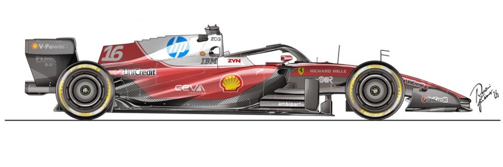

# 👋 Hola, I'm Hanser

### Estudiante de Desarrollo de Software en ITLA

*Apasionado por el desarrollo backend utilizando .NET, ASP.NET Core MVC, ASP.NET Web API, SQL Server, Onion Architecture y patrones de diseño como Repository, Adapter, Factory, Strategy y Singleton.*

```javascript
const hanser = {
    backend: {
        language: "C#",
        framework: ".NET",
        architectures: ["Onion Architecture"],
        patterns: [
            "Repository",
            "Factory",
            "Adapter",
            "Strategy",
            "Singleton"
        ]
    },

    web: {
        approaches: [
            "ASP.NET Core MVC",
            "REST APIs"
        ]
    },

    database: {
        engine: "SQL Server",
        orm: "Entity Framework Core"
    },

    frontend: [
        "HTML",
        "CSS",
        "JavaScript",
        "Bootstrap"
    ],

    tools: [
        "Git",
        "GitHub",
        "Visual Studio",
        "VS Code"
    ]
};
```
## 📬 Contacto

[](https://www.linkedin.com/in/hanserv/)
[](mailto:hanserventura@gmail.com)
